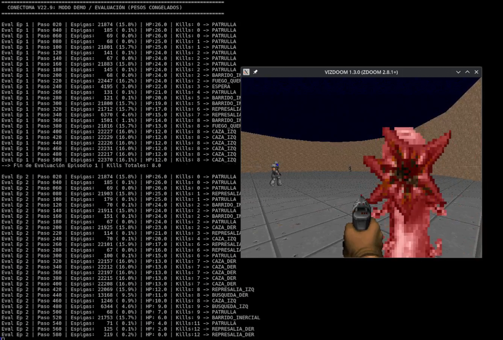
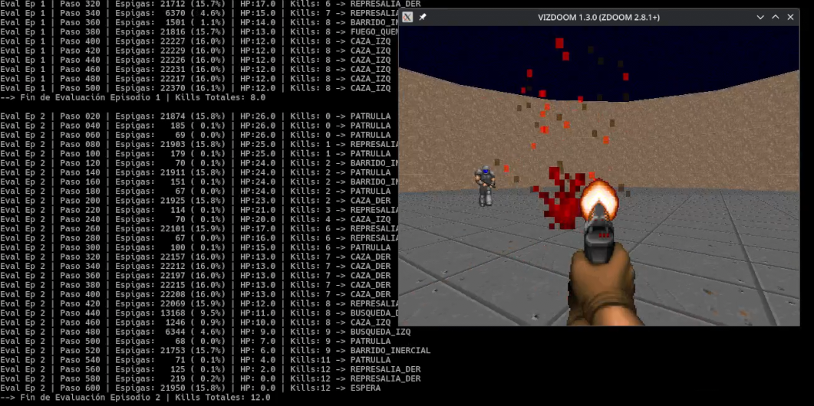
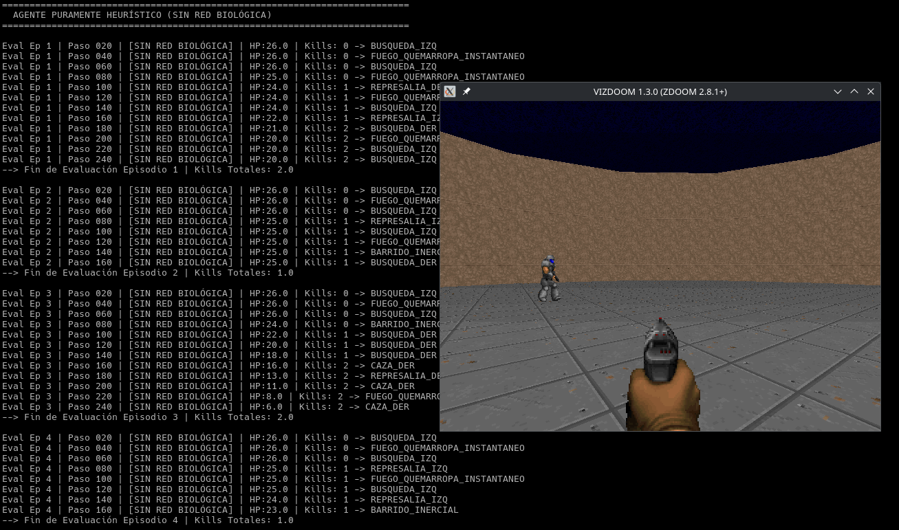
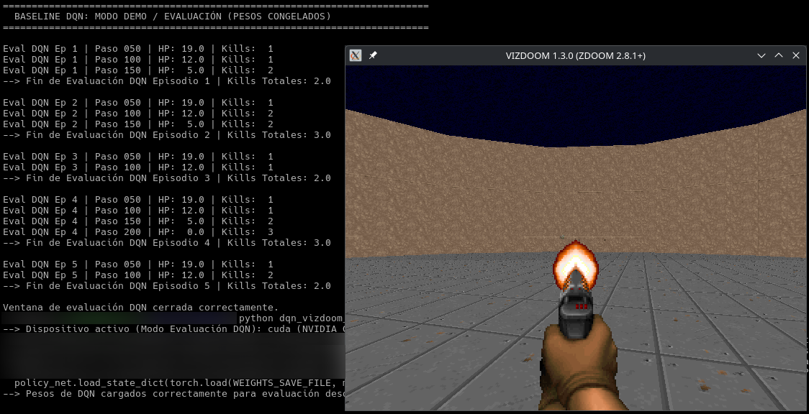
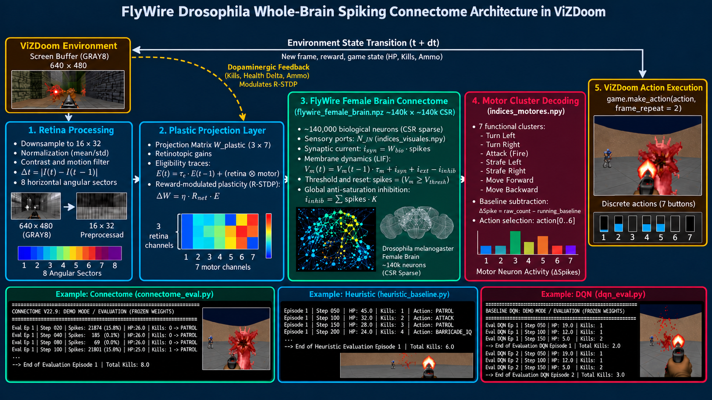

# FlyWire Drosophila Connectome vs. Deep Q-Learning in ViZDoom

A comparative benchmark evaluating sensory-motor control, computational efficiency, and learning dynamics in the ViZDoom `defend_the_center` scenario. 

This project contrasts three distinct computational paradigms: a **biophysically inspired spiking neural network derived from the full adult fruit fly (*Drosophila melanogaster*) connectome (FlyWire)**, a **purely reactive heuristic baseline without a biological network**, and a **standard Deep Q-Network (DQN) baseline**.

## Evaluation Examples

### FlyWire Connectome Agent





### Heuristic Baseline — No Connectome



### Deep Q-Network Baseline



---

## Overview

Artificial neural networks (ANNs) trained with reinforcement learning traditionally solve visual navigation tasks by relying on high-capacity dense tensor transformations and backpropagation. In nature, however, compact neural circuits solve real-time optical flow, obstacle avoidance, and target tracking under strict thermodynamic and metabolic budgets.

This repository implements the whole-brain connectome matrix of *Drosophila melanogaster* (FlyWire consortium) loaded as an adjacency graph in compressed sparse row (CSR) format. Synaptic dynamics are modeled via leaky integration, anti-saturation global inhibition, and dopamine-modulated reward-dependent plasticity (R-STDP) with eligibility traces.

---

## Architectural Paradigms

### 1. Spiking Connectome Agent (`src/connectome_*.py`)

The following diagram summarizes the closed-loop architecture of the FlyWire spiking connectome agent:

<p align="center">
  
</p>

* **Biological Substrate:** Real connectome adjacency graph loaded from `flywire_female_brain.npz` (~140,000 neurons, sparse tensor execution via PyTorch).
* **Membrane Dynamics:** Simplified Leaky Integrate-and-Fire (LIF) model defined by membrane time constant $\tau_m = 0.82$, dynamic resting/reset thresholds, and global network inhibition ($I_{\text{inhib}}$) to prevent runaway synchronization.
* **Retinotopic Input Layer:** Coarse visual mapping (16×32 resolution) partitioned into 8 horizontal sectors. Luminance and temporal motion contrast are projected directly into visual sensory indices (`indices_visuales.npy`).
* **Motor Output Decoding:** Action selection derived from spike count integration across functional motor clusters (`indices_motores.npy`) dedicated to steering, strafing, backward movement, and weapon firing.
* **Synaptic Plasticity:** Online Reward-modulated Spike-Timing-Dependent Plasticity (R-STDP) combining eligibility traces with environmental reward signals (enemy eliminations, damage avoidance, and ammo efficiency).

### 2. Heuristic Baseline (`src/heuristic_baseline.py`)
* **Control Ablation:** Evaluates the exact same retinotopic sector analysis and combat rules entirely detached from the biological spiking graph.
* **Mechanism:** Direct reactive heuristics triggered by spatial contrast salience, foveal target concentration, and damage reflexes.

### 3. Deep Q-Network (`src/dqn_*.py`)
* **Architecture:** 2D Convolutional Neural Network (Conv2d 1→16→32) followed by a 128-unit dense linear layer and a discrete action head.
* **Optimization:** Temporal Difference loss (MSE) optimized via Adam with target network updates and an Experience Replay Buffer (capacity: 10,000 transitions).

---

## Comparison Matrix

| Metric / Attribute | FlyWire Spiking Connectome | Heuristic Baseline | Deep Q-Network (CNN) |
| :--- | :--- | :--- | :--- |
| **Network Topology** | Real biological CSR graph | None (hardcoded logic) | Dense Conv2D + Linear layers |
| **Signal Processing** | Spatio-temporal spike accumulation ($V_m$) | Instantaneous thresholding | Continuous floating-point activations |
| **Adaptation Mechanism** | Outer-product eligibility traces + R-STDP | Static | Backpropagation via Adam |
| **Memory Allocation** | Static sparse adjacency matrix | Minimal CPU footprint | Dense weights + Replay Buffer states |

---

## Repository Structure

```text
├── assets/
│   └── demo_screenshot.png           # Visualization of the ViZDoom environment
├── data/
│   ├── flywire_female_brain.npz      # Full brain sparse adjacency matrix (CSR)
│   ├── indices_visuales.npy          # Retinotopic sensory neuron indices
│   ├── indices_motores.npy           # Motor cluster neuron indices
│   ├── pesos_plasticos_v23.pt        # Consolidated R-STDP weights
│   └── dqn_pesos.pth                 # Saved weights for the CNN DQN
├── src/
│   ├── connectome_train.py           # Connectome online loop with R-STDP training
│   ├── connectome_eval.py            # Real-time evaluation with frozen plastic weights
│   ├── heuristic_baseline.py         # Heuristic ablation script (no biological graph)
│   ├── dqn_train.py                  # DQN baseline training loop with replay buffer
│   └── dqn_eval.py                   # DQN evaluation script (frozen policy)
├── .gitignore
├── LICENSE
├── requirements.txt
└── README.md


## Installation & Setup

### 1. System Dependencies (Linux)

ViZDoom requires standard build tools and audio/video libraries.

**Debian / Ubuntu-based distributions**

```bash
sudo apt-get install -y build-essential zlib1g-dev libsdl2-dev libopenal-dev libboost-all-dev cmake
```

**Arch Linux / CachyOS**

```bash
sudo pacman -S --needed base-devel zlib sdl2 openal boost cmake
```

### 2. Python Environment

Set up a clean virtual environment and install the project dependencies:

```bash
git clone https://github.com/marvenarg/flywire-connectome-vizdoom.git
cd flywire-connectome-vizdoom

python3 -m venv .venv
source .venv/bin/activate

pip install -r requirements.txt
```

### 3. Data Requirements

Make sure the following files are available under the `data/` directory:

```text
data/
├── flywire_female_brain.npz
├── indices_visuales.npy
├── indices_motores.npy
├── pesos_plasticos_v23.pt
└── dqn_pesos.pth
```

If large model or connectome files are not stored directly in Git, provide them separately (for example through Git LFS or an external download) and place them in `data/` before running the corresponding scripts.

---

## Usage

### Connectome Training (R-STDP)

Executes batches of episodes, adapting the plastic projection matrix through synaptic eligibility traces and saving progress automatically:

```bash
python src/connectome_train.py
```

### Connectome Evaluation

Runs real-time inference using pre-trained, frozen plastic weights (`pesos_plasticos_v23.pt`) with graphical rendering:

```bash
python src/connectome_eval.py
```

### Purely Heuristic Baseline

Runs the baseline agent using contrast-based spatial heuristics without evaluating the biological graph:

```bash
python src/heuristic_baseline.py
```

### Deep Q-Network Baseline

Train the CNN baseline from scratch:

```bash
python src/dqn_train.py
```

Evaluate the trained DQN model:

```bash
python src/dqn_eval.py
```

---

## References

- Dorkenwald, S., et al. (2024). *Neuronal wiring diagram of an adult brain*. Nature.  
  https://doi.org/10.1038/s41586-024-07558-y

- FlyWire Consortium. *FlyWire Whole-brain Connectome Connectivity Data*, release 783.0. Zenodo.  
  https://zenodo.org/records/10676866

- FlyConnectome. *FlyWire neuron annotations*. GitHub repository.  
  https://github.com/flyconnectome/flywire_annotations

- Kempka, M., Wydmuch, M., Runc, G., Toczek, J., & Jaśkiewicz, W. (2016).  
  *ViZDoom: A Doom-based AI Research Platform for Visual Reinforcement Learning*.  
  https://arxiv.org/abs/1605.02097

- Mnih, V., et al. (2015). *Human-level control through deep reinforcement learning*. Nature, 518, 529–533.  
  https://doi.org/10.1038/nature14236

---

## License
This project is licensed under the MIT License. See the [`LICENSE`](LICENSE) file for details.
